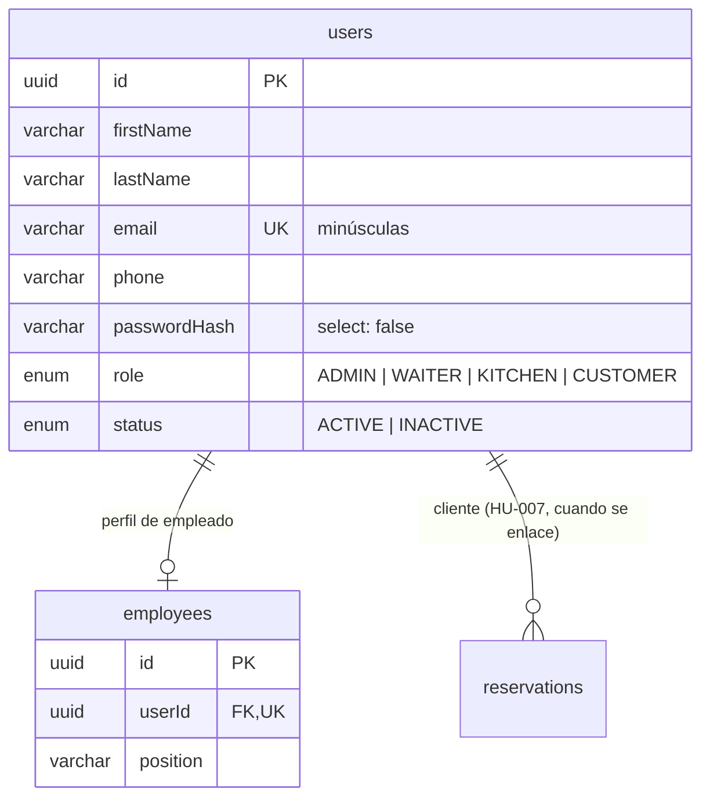

# Decisiones del equipo

Registro de decisiones de negocio y de diseño que afectan a varias historias. Cada una dice qué se decidió, por qué y dónde vive en el código. Si una decisión cambia, se añade una nueva que la reemplace; las anteriores no se borran.

## D-001 — Conflicto horario y parámetros de las reservas

**Fecha:** 7 de octubre de 2026 · **Sprint:** 2 · **Issue:** #53 · **Historias afectadas:** HU-006, HU-007, HU-009, HU-012, HU-013

### Decisión

1. **Duración de una reserva: 120 minutos.** Una reserva ocupa la mesa desde su hora de inicio hasta 120 minutos después. Se configura con `RESERVATION_DURATION_MINUTES` (entre 15 y 720).
2. **Tolerancia de no-show: 15 minutos.** Una reserva solo puede marcarse como `NO_SHOW` cuando han pasado 15 minutos desde su hora de inicio sin check-in (RN-078). Se configura con `RESERVATION_NO_SHOW_TOLERANCE_MINUTES` (entre 0 y 120).
3. **Conflicto horario.** Dos reservas de la **misma mesa** entran en conflicto si sus intervalos se solapan, tomando cada intervalo como `[inicio, inicio + duración)`, y la reserva existente está en un estado que bloquea la mesa: `PENDING`, `CONFIRMED` o `CHECKED_IN`. Las reservas `CANCELLED`, `NO_SHOW` y `COMPLETED` no bloquean.
   - En SQL: `existente.inicio < nueva.inicio + duración AND nueva.inicio < existente.inicio + duración`.
   - El intervalo es semiabierto: una reserva de 18:00 y otra de 20:00 en la misma mesa **no** chocan.
4. **Horario de atención: no se valida por ahora.** Cualquier fecha y hora futura es aceptable. Si se añade, será una decisión nueva.

### Por qué

- Las reglas RN-040 (disponibilidad) y RN-045 (asignación) hablan de "conflicto de horario" sin definirlo; sin una definición única, cada historia lo implementaría distinto.
- Una duración fija es suficiente para el alcance del proyecto y evita pedir al cliente la hora de salida. Al ser configurable, se puede ajustar sin tocar el código.

### Dónde vive

- Variables: `src/config/env.validation.schema.ts` (validación y valores por defecto), `.env.example` y la tabla de variables del `README.md`.
- Lectura desde el código: `ConfigService` → `reservations.durationMinutes` y `reservations.noShowToleranceMinutes` (`src/config/env.config.ts`). No se escriben los números en los services.

## D-002 — Modelo de usuarios, roles y contraseñas

**Fecha:** 7 de octubre de 2026 · **Sprint:** 2 · **Issue:** #74 · **Historias afectadas:** HU-014 a HU-020

### Decisión

1. **Una sola tabla `users` para todas las cuentas** (clientes y empleados): credenciales y datos comunes (`firstName`, `lastName`, `email`, `phone`, `passwordHash`, `role`, `status`). Un cliente es un usuario con rol `CUSTOMER`; no hace falta tabla `customers` porque no tiene datos propios.
2. **Los empleados tienen además un perfil `employees`** (1:1 con `users`) con su cargo (`position`), que crea HU-016. Así el login, el perfil (HU-019) y la recuperación de contraseña (HU-018) funcionan igual para todos.
3. **El rol vive en `users.role`**, enum `ADMIN | WAITER | KITCHEN | CUSTOMER` (HU-017). Se crea ya con HU-014 porque el token de HU-015 lo lleva en su payload. Un usuario tiene un solo rol.
4. **Estado de la cuenta:** `users.status`, enum `ACTIVE | INACTIVE`; toda cuenta nueva empieza `ACTIVE` (RN-086, RN-097) y una `INACTIVE` no puede iniciar sesión (RN-090, RN-098).
5. **El email se guarda en minúsculas y es único** (RN-082, RN-095), con índice único en la base.
6. **Contraseñas con scrypt** (`node:crypto`), parámetros N = 2¹⁴, r = 8, p = 5 (uno de los perfiles mínimos que recomienda OWASP), sal aleatoria de 16 bytes por contraseña y comparación en tiempo constante. Se guarda como `scrypt$N$r$p$sal$hash` para poder subir el coste más adelante sin invalidar las contraseñas existentes. `passwordHash` no se selecciona por defecto (`select: false`) y nunca sale en una respuesta (RN-085, RN-087).
7. **Política de contraseñas:** entre 8 y 128 caracteres, con al menos una letra y un número (RN-083). La aplica el mismo validador en registro (HU-014), alta de empleados (HU-016) y restablecimiento (HU-018, RN-105).
8. **El primer `ADMIN` se crea con el seed** (`npm run seed`) a partir de variables de entorno, en HU-017 (#84). Sin él nadie puede dar de alta empleados.

### Por qué

- **Tabla única de credenciales:** login, JWT, perfil y recuperación de contraseña se escriben una sola vez. Con tablas separadas por tipo de usuario habría que buscar el email en dos sitios y garantizar a mano que no se repite entre ellas.
- **scrypt en lugar de bcrypt o argon2:** viene en Node, sin dependencias nativas que compilar en Docker (`node:24-alpine`) ni en el CI, y es una función de derivación aceptada por OWASP para contraseñas. bcrypt además trunca las contraseñas a 72 bytes.

### Dónde vive

- `src/modules/users/` → entidad `User`, enums `UserRole` y `UserStatus`, `UsersService` y `PasswordService` (exportados para HU-016 y HU-018).
- `src/common/validators/` → `@Match()` (confirmación de contraseña) y `@MeetsPasswordPolicy()` (política).
- `src/modules/auth/` → registro (HU-014) y login (HU-015).

## D-003 — Mesas que cuentan para la disponibilidad

**Fecha:** 9 de octubre de 2026 · **Sprint:** 2 · **Issue:** #55 · **Historias afectadas:** HU-006, HU-007, HU-009

### Decisión

1. **La consulta de disponibilidad excluye solo las mesas `OUT_OF_SERVICE`** (RN-041). Las mesas `AVAILABLE` y `OCCUPIED` sí pueden recibir reservas, siempre que tengan capacidad suficiente y no tengan una reserva en conflicto (D-001).
2. **Precisa RN-038** ("solo podrán considerarse mesas con estado `AVAILABLE`"): se interpreta como "mesas operativas", es decir, que no estén fuera de servicio.
3. La misma regla aplica a la asignación automática de mesa al registrar (HU-007) y a la modificación de una reserva (HU-009), porque las dos reutilizan `findAvailableTables`.

### Por qué

- El estado de la mesa describe **el momento actual**: `OCCUPIED` significa que hay clientes sentados ahora (lo pone el check-in, HU-012). Una reserva es para otra fecha u hora, así que ese estado no dice nada sobre si la mesa estará libre entonces; eso lo decide el conflicto horario de D-001.
- Con la lectura literal de RN-038, una mesa con clientes sentados hoy no se podría reservar para ningún día futuro hasta liberarse, lo que bloquearía reservas válidas.
- `OUT_OF_SERVICE` sí se excluye porque indica que la mesa no se puede usar (RN-019, RN-041), sin fecha de vuelta conocida.

### Dónde vive

- `ReservationsService.findAvailableTables` (`src/modules/reservations/reservations.service.ts`): condición `status != OUT_OF_SERVICE`.
- Pruebas e2e de disponibilidad: una mesa `OUT_OF_SERVICE` nunca aparece y una `OCCUPIED` sí.
